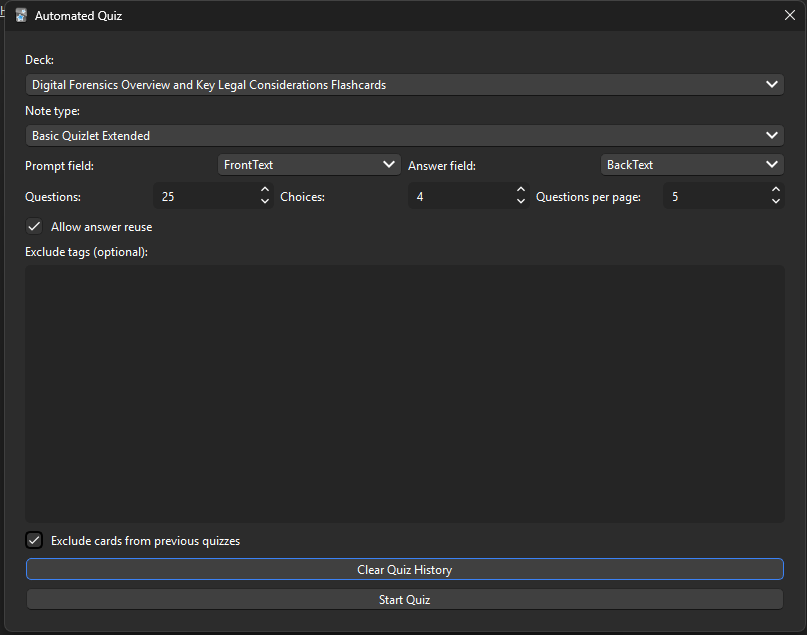
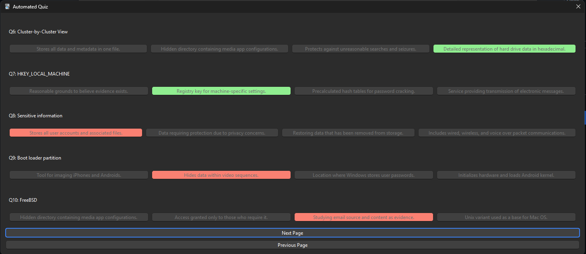

# Anki Automated Quizzes (v0.0.3)

An Anki add-on that generates randomized multiple-choice quizzes from a deck.

Inspired by [@nguyenphanvn95's](https://github.com/nguyenphanvn95) [MCQAnkitest](https://github.com/nguyenphanvn95/MCQAnkitest)

## Features
- Tools → Automated Quiz.
- Pick a deck
- Choose number of questions and choices
- Choose number of questions per page
- Optional: allow reuse of answers to support small decks
- Optional: save quiz history and prevent question reuse

- Exclude tags
- Score and quick feedback
- Optional: export quiz results to HTML
- Optional: clear quiz history to reset question pool

## Use Case's

This add-on allows you to create quizzes from Anki decks as an alternative to Quizlet's quiz function.

Great to pair with [@sviatoslav-lebediev's](https://github.com/sviatoslav-lebediev) [anki-quizlet-importer-extended](https://github.com/sviatoslav-lebediev/anki-quizlet-importer-extended) add-on to scrape decks directly from Quizlet.